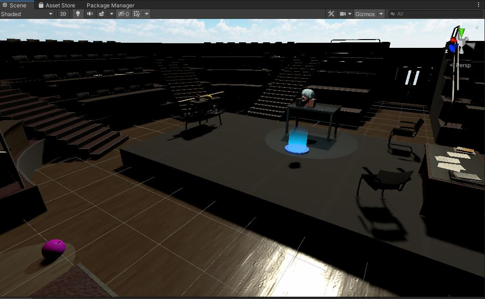

# StageCraft.live
Online multiplayer theater system built with Unity (XR Plugin, Universal Render Pipeline) and Normcore

Goal is to enable multiple actors to do an improv scene, each using Oculus Quests.  

Working (in "StageCraft" Unity project):
* Normcore 2 VR multiplayer working (basic avatars, with voice chat, mouth movement)
* Basic "theater-in-the-round" set with spotlights
* Running on Oculus Quest under Unity 2020.1.10f1

Next steps:
* Enable locomotion (XRlocomotion seems to conflict with Normcore somehow: end up with XR Rig players "stacked" atop each other)
* Improve grabbing of objects (distance grab)
* Avatar customization (change "costumes")
* Enable AR viewing of the performance (per https://normcore.io/documentation/guides/using-ar-as-spectator.html)
* See [Github Issues list](https://github.com/tedbarnett/StageCraft/issues) above

Collaborators appreciated.

