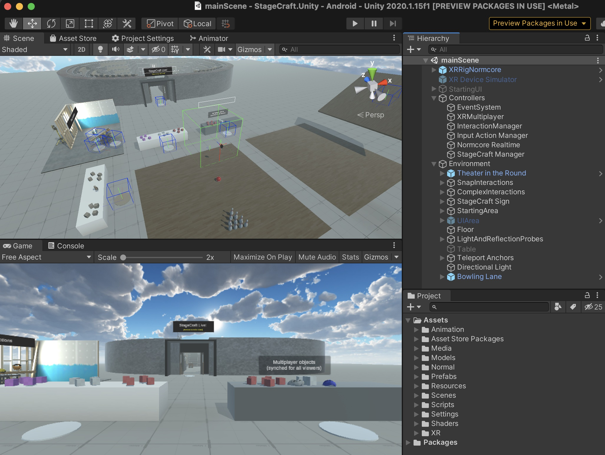

# StageCraft Live!
Online multiplayer theater system built with Unity (XR Plugin, Universal Render Pipeline) and Normcore

Goal is to enable multiple actors to do an improv scene, each using Oculus Quests, with a mobile or VR audience of viewers 

Working (in "StageCraft" Unity project):
* Normcore 2 VR multiplayer working (basic avatars, with voice chat, mouth movement)
* Basic "theater-in-the-round" set
* Teleport and continuous locomotion (but not yet visible to other players via Normcore!)
* Grab-able objects
* Running on Oculus Quest under Unity 2020.1.15f1

Next steps:
* Avatar customization (change "costumes")
* Enable AR viewing of the performance (per https://normcore.io/documentation/guides/using-ar-as-spectator.html)
* See [Github Issues list](https://github.com/tedbarnett/StageCraft/issues) above

Collaborators appreciated.

